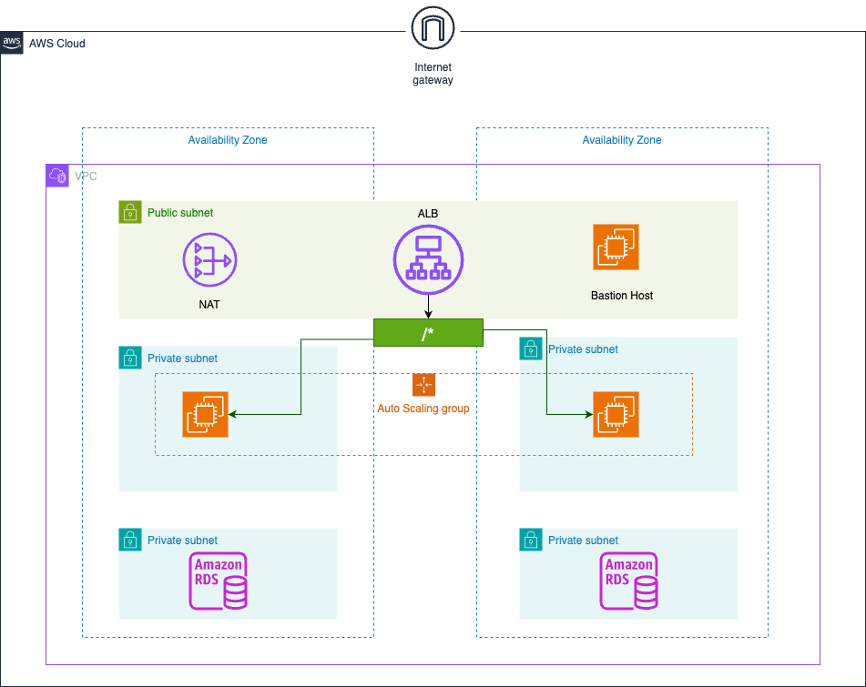

# 3-Tier AWS Architecture with Terraform

## 📋 Overview

This project deploys a scalable 3-tier web application architecture on AWS using Terraform. The architecture consists of:

- **Presentation Tier**: Application Load Balancer (ALB)
- **Application Tier**: Auto Scaling Group with EC2 instances
- **Database Tier**: RDS PostgreSQL database

## 🏗️ Architecture



_3-Tier AWS Architecture with Terraform_

## 🛠️ Components

### 1. **Networking Module**

- **VPC**: Custom VPC with DNS support
- **Subnets**:
  - 2 Public subnets (for ALB)
  - 2 Private subnets (for EC2 instances)
  - 2 Database subnets (for RDS)
- **Internet Gateway**: For internet access
- **NAT Gateway**: For outbound internet access from private subnets
- **Security Groups**:
  - ALB Security Group (HTTP from anywhere)
  - Web Security Group (HTTP from ALB)
  - Database Security Group (PostgreSQL from Web tier)

### 2. **Auto Scaling Module**

- **Application Load Balancer**: Distributes traffic across EC2 instances
- **Launch Template**: Defines EC2 instance configuration
- **Auto Scaling Group**: Manages EC2 instances (min: 1, max: 2, desired: 1)
- **IAM Instance Profile**: Provides RDS access permissions
- **Target Groups**: Health checks and routing

### 3. **Database Module**

- **RDS PostgreSQL**: Managed database service
- **Random Password**: Auto-generated secure password
- **Subnet Group**: Database subnets for high availability
- **Security Group**: Restricted access from application tier only

### 4. **IAM Module**

- **Instance Profile**: Allows EC2 instances to access RDS
- **Custom Policies**: RDS access, CloudWatch logs, Secrets Manager

## 📁 Project Structure

```
3-tier-aws-terraform/
├── main.tf                 # Main Terraform configuration
├── variables.tf            # Variable definitions
├── outputs.tf              # Output definitions
├── versions.tf             # Provider versions
├── terraform.tfvars        # Variable values
├── envs/
│   └── dev.tfvars         # Development environment variables
└── modules/
    ├── networking/
    │   ├── main.tf        # VPC, subnets, security groups
    │   ├── variables.tf   # Networking variables
    │   └── outputs.tf     # Networking outputs
    ├── autoscaling/
    │   ├── main.tf        # ALB, ASG, Launch Template
    │   ├── variables.tf   # Autoscaling variables
    │   ├── outputs.tf     # Autoscaling outputs
    │   └── user-data.sh   # EC2 initialization script
    └── database/
        ├── main.tf        # RDS configuration
        ├── variables.tf   # Database variables
        └── outputs.tf     # Database outputs
```

## 🚀 Getting Started

### Prerequisites

- AWS CLI configured with appropriate credentials
- Terraform >= 1.0
- SSH key pair created in AWS (for EC2 access)

### 1. Clone the Repository

```bash
git clone <repository-url>
cd 3-tier-aws-terraform
```

### 2. Configure Variables

Edit `envs/dev.tfvars`:

```hcl
aws_region   = "ap-southeast-1"
project_name = "three-tier-aws-terraform"
environment  = "dev"

vpc_cidr_block   = "10.0.0.0/16"
public_subnets   = ["10.0.1.0/24", "10.0.2.0/24"]
private_subnets  = ["10.0.4.0/24", "10.0.5.0/24"]
database_subnets = ["10.0.7.0/24", "10.0.8.0/24"]

ec2_instance_type                = "t2.micro"
ec2_instance_key_name            = "your-key-pair-name"
ec2_autoscaling_min_size         = 1
ec2_autoscaling_max_size         = 2
ec2_autoscaling_desired_capacity = 1

db_instance_type  = "db.t3.micro"
db_engine         = "postgres"
db_engine_version = "17"
db_name           = "mydatabase"
db_username       = "dbadmin"
```

### 3. Deploy Infrastructure

```bash
# Initialize Terraform
terraform init

# Plan deployment
terraform plan -var-file="envs/dev.tfvars"

# Apply configuration
terraform apply -var-file="envs/dev.tfvars"
```

### 4. Access Your Application

After deployment, get the ALB DNS name:

```bash
terraform output alb_dns_name
```

Visit `http://<alb-dns-name>` in your browser.

## 🔧 Configuration Details

### Security Groups

- **ALB Security Group**: Port 80 from 0.0.0.0/0
- **Web Security Group**: Port 80 from ALB Security Group
- **Database Security Group**: Port 5432 from Web Security Group

### IAM Permissions

EC2 instances have the following permissions:

- RDS describe operations
- RDS database connect
- Secrets Manager access
- CloudWatch logs access

### Auto Scaling

- **Scaling Policy**: Target tracking based on CPU utilization
- **Health Checks**: ELB health checks with 300s grace period
- **Rolling Updates**: 50% minimum healthy instances

## 🛡️ Security Best Practices

- ✅ Private subnets for application tier
- ✅ Database in isolated subnets
- ✅ Security groups with minimal required access
- ✅ Auto-generated database passwords
- ✅ IAM roles with least privilege
- ✅ Encrypted connections supported

## 🔍 Monitoring & Logging

- CloudWatch metrics for Auto Scaling
- ALB access logs
- RDS performance insights
- EC2 instance monitoring via CloudWatch

## 🧹 Cleanup

To destroy the infrastructure:

```bash
terraform destroy -var-file="envs/dev.tfvars"
```

## 🤝 Contributing

1. Fork the repository
2. Create a feature branch
3. Make your changes
4. Submit a pull request

## 📜 License

This project is licensed under the MIT License.

## 🆘 Troubleshooting

### Common Issues

1. **Key Pair Not Found**: Ensure your SSH key pair exists in the specified AWS region
2. **Insufficient Permissions**: Check AWS credentials have required permissions
3. **Resource Limits**: Verify AWS account limits for EC2, RDS, etc.
4. **Database Username**: Avoid reserved words like 'admin', 'root', 'postgres'

### Useful Commands

```bash
# View current state
terraform show

# Check resource status
terraform state list

# Refresh state
terraform refresh -var-file="envs/dev.tfvars"

# Import existing resources
terraform import aws_instance.example i-1234567890abcdef0
```

## 📞 Support

For questions or issues, please open an issue in the repository.
